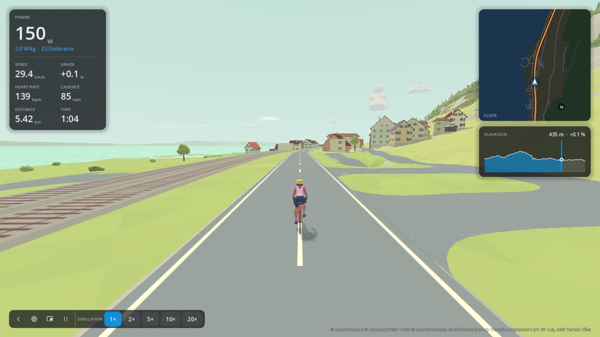

  <picture>
    <source media="(prefers-color-scheme: dark)" srcset="docs/brand/torqa-lockup-dark.svg">
    
  </picture>

# Torqa

A modern, offline-first, open-source indoor cycling app. Import a GPX route or a ride video and
ride it on your smart trainer through a generated 3D world or along the video.

> **Status:** early development — see [docs/PLAN.md](docs/PLAN.md) for what is done and what
> comes next.

## Features

Working today:

- Smart trainer control over Bluetooth FTMS (tested with the CLI on a Wahoo KICKR Core 2): SIM, ERG,
  resistance; heart-rate straps; the devices used last reconnect at start
- Virtual gears on a single cog, shifted from the keyboard or a Shimano Di2's hood buttons,
  which can also work the camera, the overlay or the music
- GPX import with terrain-corrected elevation, auto-detected climbs
- Stylized, faceted 3D worlds in a pastel palette, generated from real terrain and
  OpenStreetMap data (roads, buildings by kind — churches, castles and lighthouses among them —,
  forests, water, railways; palms and houses built for the heat in the subtropics), with cameras,
  time of day and weather
- Course library: prepared routes as `.tqc` files that ride offline on any computer
- Video courses: GoPro videos with GPS, Incyclist route videos, Tacx RLV and any video aligned
  with a GPX route; the video plays at your speed, its sound too
- Realistic physics, adjustable trainer difficulty, descent modes; ghosts and pacers
- Workouts: hold a power or a heart rate, structured workouts (ZWO, ERG/MRC, FIT files and an
  editor), three FTP tests; on their own or on a course in 3D
- An overlay: just your HUD on top of other windows, e.g. over a video
- Rider profiles with adjustable zones, a customizable HUD, music control, English and German
- FIT export, ride history and analysis, personal records per course and climb

Planned: Street View / Mapillary rides, uploads to Strava, intervals.icu and others, ANT+ FE-C,
hardware video decoding. See [docs/REQUIREMENTS.md](docs/REQUIREMENTS.md) for the full list.

## Using Torqa

| Topic | Doc |
|---|---|
| Start page, course gallery and course pages | [docs/start.md](docs/start.md) |
| Courses: offline riding and sharing | [docs/courses.md](docs/courses.md) |
| Video courses | [docs/video.md](docs/video.md) |
| Devices, riding and in-ride settings | [docs/riding.md](docs/riding.md) |
| Riders, zones | [docs/riders.md](docs/riders.md) |
| Ride HUD | [docs/hud.md](docs/hud.md) |
| Workouts and FTP tests | [docs/workouts.md](docs/workouts.md) |
| Overlay over other apps | [docs/overlay.md](docs/overlay.md) |
| Ghosts and pacers | [docs/ghosts.md](docs/ghosts.md) |
| Ride history, climbs and records | [docs/history.md](docs/history.md) |
| Music control | [docs/audio.md](docs/audio.md) |
| Translations | [docs/translating.md](docs/translating.md) |
| Command-line tool for testing trainers | [docs/cli.md](docs/cli.md) |

## Development

All tooling runs in a container — nothing is installed on your machine.

1. Install [Docker](https://www.docker.com/) and [VS Code](https://code.visualstudio.com/) with the
   [Dev Containers](https://marketplace.visualstudio.com/items?itemName=ms-vscode-remote.remote-containers) extension.
2. Open this folder in VS Code and choose **Reopen in Container**.

Without VS Code, `scripts/dev.sh <command>` runs any command in the same container.

| Task | Command (inside the container) |
|---|---|
| All checks (fmt, clippy, tests, cargo-deny, translations, gdlint, gdformat, Godot smoke tests) | `scripts/check.sh` |
| Build the GDExtension into `app/bin/` | `scripts/build-gdext.sh [debug\|release]` |
| Render screenshots of the start page, a ride and the summary (software Vulkan) into `screenshots/` | `scripts/screenshots.sh` |
| Render the standard views of the 3D world (before and after a visual change) into `screenshots/views/` | `scripts/render-views.sh` |
| Render the 3D models (buildings, plants, clouds) and the riders for review; with `GALLERY=docs/images/models`, also the galleries in `art/README.md` | `scripts/render-models.sh`, `scripts/render-riders.sh` |
| Regenerate the boot splash PNG after a logo change | `scripts/render-splash.sh` |
| Refresh the translation template after text changes | `python3 scripts/i18n/extract.py` |
| Run the CLI with the fake trainer | `cargo run --manifest-path core/Cargo.toml -p torqa-cli -- ride --fake` |

The 3D models are Blender scripts in `art/` (see [art/README.md](art/README.md) for them and a
gallery of every model); Blender runs in its own container on the host:
`scripts/art.sh blender --background --factory-startup --python art/<group>/build.py`.

To test real trainers on macOS, use the CLI built by CI: see [docs/cli.md](docs/cli.md).

Windows builds come from the `windows` CI job: `Torqa-windows-x86_64.zip` (`Torqa.exe` with
`torqa_gd.dll` beside it; keep both in one folder) and `torqa-cli-windows-x86_64.zip`, both under
the run's artifacts. Like the macOS app it is built natively on the runner (MSVC, with MSYS2's
`sh` and `make` for FFmpeg).
FFmpeg's libraries come from `scripts/build-ffmpeg.sh` (a pinned, verified release; ADR 0010):
built into the dev image, and once per platform in CI.

Linux builds come from the `linux` CI job, for x86_64 and arm64: `Torqa-linux-<arch>.tar.gz`
(a `Torqa` folder with `Torqa.<arch>` and `libtorqa_gd.so`; keep both together) and
`torqa-cli-linux-<arch>.tar.gz`. They are built on Ubuntu 22.04 so they run on any distribution
with glibc 2.35 or newer (Ubuntu 22.04+, Debian 12+, Fedora 36+), not only on ones as new as
the dev container ([ADR 0012](docs/adr/0012-linux-builds.md)). CI starts the exported app
headless to check that it loads.

Docker on macOS cannot access Bluetooth or the GPU, so macOS builds are produced by GitHub Actions.
To test 3D rendering or a real trainer, run the built app (or the portable Godot editor) natively.

Contributor conventions: [CLAUDE.md](CLAUDE.md). Architecture decisions: [docs/adr/](docs/adr/).
Third-party assets and their licences: [docs/CREDITS.md](docs/CREDITS.md).

## License

[GPL-3.0](LICENSE)
