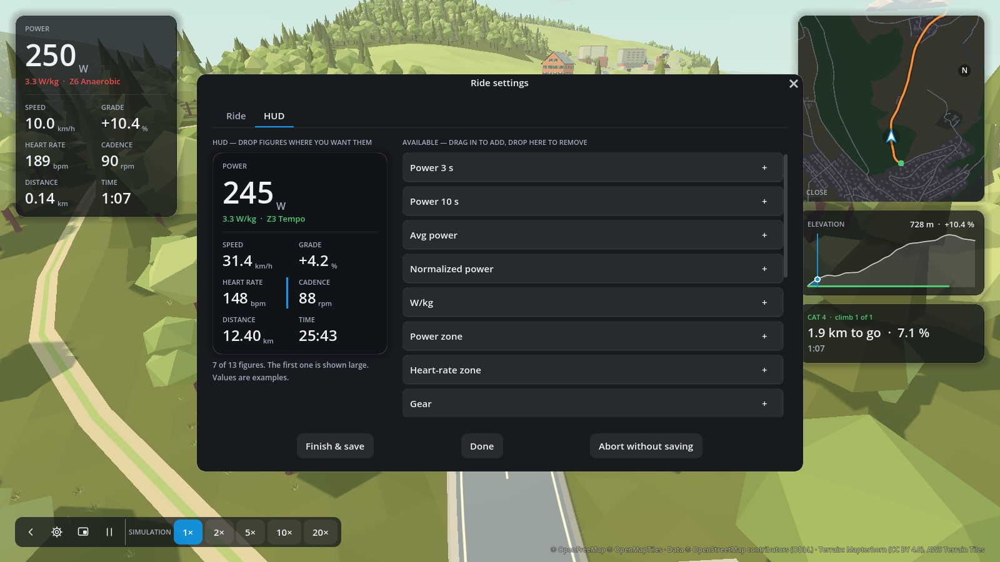

# Ride HUD

The figures on the left of the ride screen are yours to choose, per rider. Edit them in
**Rider settings → HUD** (the **Profile** tab → the pencil), or with
**Settings → HUD** while riding (button or key S) — the ride keeps going, and changes are
saved to the rider.

The editor shows the **HUD** itself with example values, and the figures still **available**.

- **Drag a figure straight into the HUD** to where it should appear: a blue line shows where
  it will land — before or after the figure under the pointer (left/right in the grid,
  above/below the large figure). Dropping on free space adds it at the end; + does the same
  with a click.
- **Move** figures by dragging them within the HUD, and **drag them back** onto the available
  list to remove them.
- The **first** figure is shown large at the top; with power figures, your W/kg and power zone
  appear below it. Up to 13 figures in total.

| Figure | Meaning |
|---|---|
| Power, Power 3 s, Power 10 s | Instant power and its average over the last 3 or 10 seconds |
| Avg power, Normalized power | Over the ride so far ([history.md](history.md) explains NP) |
| W/kg, Power zone | Power per kilogram body weight, zone from your FTP |
| Heart rate, Heart-rate zone | From a heart-rate strap, zone from your maximum heart rate |
| Cadence | Pedal revolutions per minute |
| Gear | The virtual gear (1–24) on a single cog ([riding.md](riding.md#virtual-gears)) |
| Speed, Avg speed | Virtual speed |
| Distance, To go | Ridden so far, left to the finish |
| Time | Since the start (pauses do not count) |
| Elevation, Climbed, Ascent to go | Current altitude, climbing so far, climbing still ahead on the route |
| Grade, Next 500 m | Gradient here, and on average over the next 500 m |
| Intensity, TSS, Work | Intensity factor, training stress score and kilojoules so far |

Each rider has their own layout, stored in `profiles/<rider>/hud.toml`. Units follow the rider's
profile (metric or imperial).
