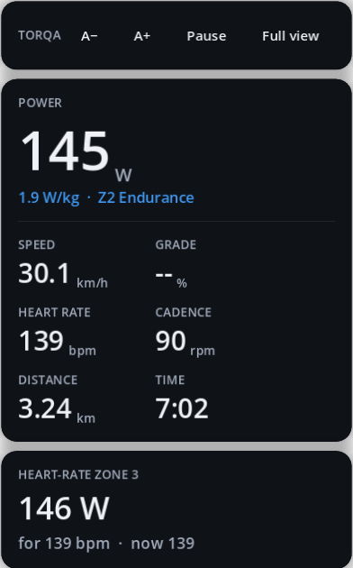

# Overlay

The overlay (R55, R57) turns Torqa's window into just your HUD, small, borderless and on top of
other windows, so you can watch a video or a stream in another app while you ride. The window
is see-through between the panels; the panels themselves are solid, so what is behind them
does not show through the figures. The ride goes on as before: the trainer keeps following the
course or holding the workout's power, and the ride is recorded and saved as usual.

## Entering and leaving

- **During any ride or workout:** the **Overlay** button next to *Settings*, or **O**.
- **When starting a workout:** tick **Start as overlay** on the Workouts tab
  ([workouts.md](workouts.md)).
- **Back:** **Full view** in the overlay's bar, or **O** / **Esc** while the overlay has the
  focus. The window returns to its size and place (and full screen) from before.

**Pause** in the bar, or **P** / space while the overlay has the focus, pauses the ride and
goes on with it, as in the full view ([riding.md](riding.md)).

When a course ride reaches the finish, the whole screen comes back for its summary. To finish
a workout, go back to the full view and use *Settings* → *Finish & save*.

## Moving and resizing

- Drag the overlay by its top bar (with **Torqa** on it).
- **A+** and **A−** in the bar, or **+** and **−** while the overlay has the focus, make it a
  step larger or smaller, text and all. The corner nearest the screen's edge stays put.
- Drag the grip in the bottom right corner to resize it; the figures grow and shrink with it.
- Clicks beside the HUD go to the window below.

The overlay opens where it was the last time and as large as you left it, also after a restart
(if that place is still on a screen). The first time it opens at the top right of the screen,
as large as the HUD in the full-screen ride view and at least 1.25 times its normal size, to be
read from the saddle.

## Limits

- The overlay stays on top of normal windows, **not of full-screen apps** (R57): a video in a
  maximised browser window works, one in full-screen mode covers the overlay. On macOS, showing
  over full-screen apps would need native window code Torqa does not have.
- The 3D world is not drawn while the overlay shows; it is there again in full view.
- On Wayland (Linux), staying on top depends on the compositor.
