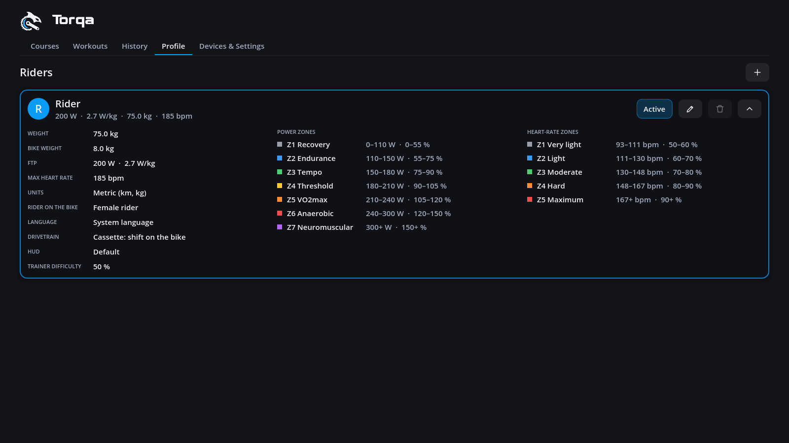
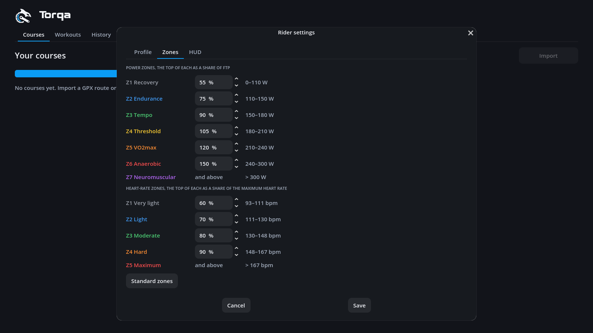

# Riders

Each rider has a profile: name, weight, bike weight, FTP, maximum heart rate, trainer difficulty,
units, language, the rider on the bike and the drivetrain, plus their training zones and HUD.
The **Profile** tab lists the riders as cards, each with its key figures; the active one
is marked, **Use** on another makes it the rider. The pencil on a card changes that rider, the
plus at the top adds one. The bin deletes a rider together with all their rides, after asking;
the last rider cannot be deleted, and deleting the active one switches to another. The chevron
unfolds a card to the rider's whole setup in three columns: every setting the dialog has (the
HUD as **Default** or **Custom**), the power zones and the heart-rate zones, each zone with its
range.

**Rider settings** (the pencil) has three tabs: **Profile**, **Zones** and **HUD**.

- **Weight + bike weight** set how hard climbs are and how fast you roll.
- **FTP** sets the power zones shown under the power figure, together with watts per kilogram.
- **Maximum heart rate** sets the heart-rate zones.
- **Trainer difficulty** is the share of the road's gradient you feel on the trainer that every
  ride starts with (0–100 %, 50 % unless you change it); the course page shows it, and the ride
  settings change it for one ride ([riding.md](riding.md)).
- **Units** switch speed, distance and elevation between km/h, km, m and mph, mi, ft.
- **Language** of the interface: the computer's, or one you choose ([translating.md](translating.md)).
- **Rider on the bike**: a female or a male rider rides for you in the 3D world.
- **Drivetrain**: with a **cassette** you shift on the bike as outdoors. On a **single cog**
  (e.g. the Zwift Cog) Torqa gives you 24 **virtual gears** (R9): set your chainring and the
  cog's teeth, and shift with **↑** and **↓** while riding (see [riding.md](riding.md)).

**Zones**: seven power zones as shares of your FTP (Coggan's: Recovery < 55 %, Endurance
≤ 75 %, Tempo ≤ 90 %, Threshold ≤ 105 %, VO2max ≤ 120 %, Anaerobic ≤ 150 %, Neuromuscular
above) and five heart-rate zones as shares of your maximum heart rate (≤ 60, 70, 80, 90 % and
above). Set the top of each zone yourself; the watts and beats it comes to show beside it, and
**Standard zones** puts them back. The HUD, the history's time in zones and heart-rate
workouts all follow your zones.

**HUD**: the figures you see while riding ([hud.md](hud.md)).

Profiles are stored in the data directory as `profiles/<rider>/profile.toml` and can be edited by
hand; each rider's activities are saved in `profiles/<rider>/rides/`. Courses are shared by all
riders.
