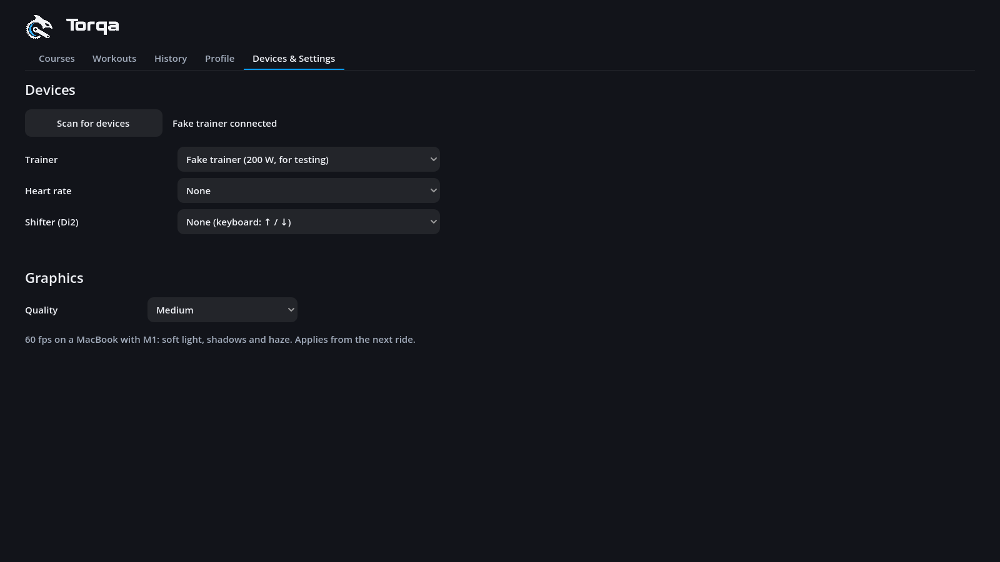
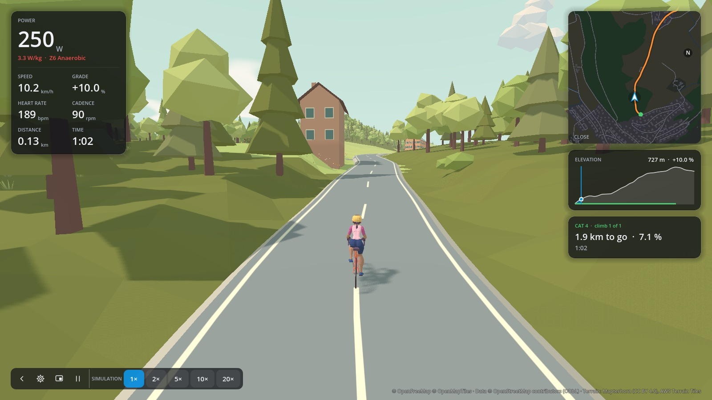
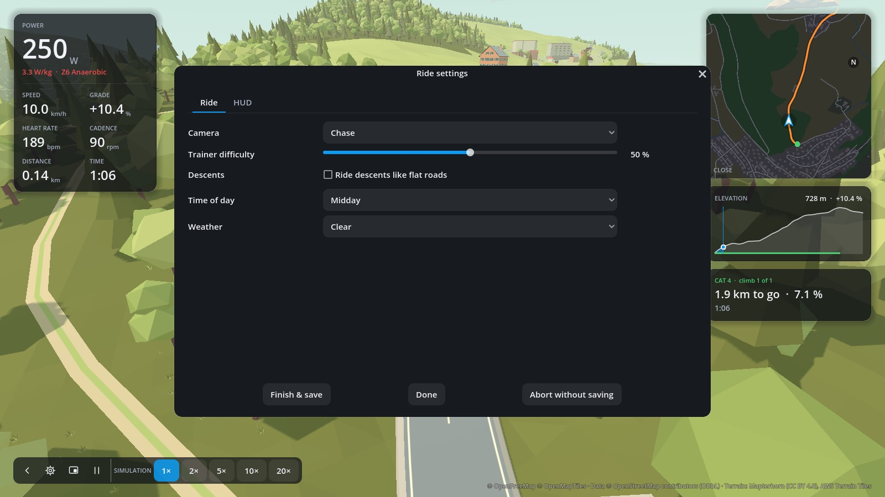

# Devices and riding

## Devices

Torqa remembers the trainer, heart-rate strap and Di2 shifter you used last and **reconnects
them in the background** when it starts — they appear selected in **Devices & Settings**. If one
is not found (asleep, or connected to another app), that tab says so: pedal to wake the trainer
or put on the strap, then press **Scan for devices**. Choosing another device and riding with it
makes that one the remembered device. **Fake trainer** rides a simulation without hardware (see
below).

## During a ride

The ride screen keeps the road in view — the 3D world, or the video on video courses
([video.md](video.md)): your figures on the left, map, elevation profile, climb
and ghost panels on the right, and a slim bar of controls at the bottom left, each with a
tooltip: **Settings** (or key **S**), **Overlay** (or **O**), which shrinks Torqa to just your
figures on top of other windows, e.g. to watch a video while you ride
([overlay.md](overlay.md)), **Pause** (or **P**), and on simulated rides the speeds. Once the
ride is saved, a flag there opens its summary. The chevron at the bar's left folds the bar away
to the corner and brings it back; Torqa remembers that, and the keys work either way.

**Settings** opens the ride settings; changes apply at once and the ride keeps going:

- **Ride**: camera (chase, first person, drone), trainer difficulty (starting from the rider's
  own, [riders.md](riders.md)), descents ridden like flat roads, time of day and weather — the
  same options as on the course page. Mornings bring fog lying in the valleys below you, never
  around you; haze and rain thicken it, and the distance is a little hazier in low sun. In
  rain, faceted drops fall, roads and streets turn darker with a soft sheen, and puddles stand
  where they are level.
- **Workout** (in workouts): change what the workout asks for ([workouts.md](workouts.md)).
- **HUD**: arrange your figures (see [hud.md](hud.md)).
- **Finish & save** ends the ride, saves it and shows its summary (name it there; see
  [history.md](history.md)).
- **Abort without saving** ends the ride after asking once; nothing is saved.

Keys: **P** (or space) pauses the ride and goes on with it: the clock, the rider and the
trainer wait (it lets go of its resistance), and the time paused is not recorded. **C**
switches the camera, **S** opens the settings, **O** the overlay, **↑** / **↓** shift the
virtual gears, **M** / **.** / **,** control your music ([audio.md](audio.md)).

The power and heart-rate zones in the HUD are the rider's own ([riders.md](riders.md)).

### Virtual gears

With a single cog set as your drivetrain ([riders.md](riders.md)), Torqa shifts for you: 24
gears from a mountain-bike low (0.75) to a sprint gear (5.5, chainring over cog), about 9 %
apart. A ride starts in the gear nearest to your real one; **↑** shifts harder, **↓** easier,
and the trainer feels the new gear at once. With a **Shimano Di2** bike, the hood buttons can shift
too: assign them to D-Fly channels in E-TUBE, then choose the shifter under Devices & Settings
(it reconnects at start like the trainer). There you also choose what each channel does when
pressed, held or double-pressed: shift one or two gears, the next camera, the overlay on or
off, or the music (play/pause, next, previous). Until you change it, the first channel shifts
up and the second down, two gears on a double press. The gear shows briefly when it changes, and as the
**Gear** figure if you add it to your HUD. In a bigger gear the same cadence means more speed,
so the trainer brakes harder — exactly as the road would in that gear. Workouts in ERG hold
their power in any gear.

On video courses the video is the view: the course page and the ride settings offer trainer
difficulty, descents and the video's **Sound** instead, and **C** does nothing.

## The 3D world

The world is built from the map around the course (OpenStreetMap): the road you ride follows the
mapped road, other streets, tracks and paths lie beside it and meet it and each other with
rounded corners, and buildings stand where they are mapped. The map rarely says what a building
is, so Torqa infers it from where it stands and its size. That gives:

- churches with a tower, and chapels with a turret on the roof;
- castles with crenellated walls and round corner towers, where the map has a castle (ruins
  stay as mapped);
- lighthouses in bands of white and red with a lantern on top, where the map names one, also
  where it has no outline for the tower;
- chalets with timber walls and deep eaves in the mountains;
- farmhouses under big roofs in the countryside;
- apartment blocks, and metal-clad halls on industrial land;
- offices with bands of glass on commercial land or where the map has offices;
- hotels with balconies all along their fronts, where the map has a hotel or guest house;
- schools, town halls, hospitals and the like, where the map has them or on school and
  hospital grounds: an entrance bay under a canopy and a flag, classic under a hipped roof or
  modern with bands of colour at every floor;
- houses and sheds everywhere else;
- shops, cafés and restaurants with a glazed front and an awning onto their street, where the map
  has one.

In the subtropics (within 27° of the equator, below 1,200 m: Okinawa, Ishigaki, Hawaii,
southern Florida and the like) the world changes with the climate: palms, banana plants and
broadleaf shrubs grow instead of conifers and the usual bushes, and houses are built for the
heat — light plastered concrete under flat roofs with a water tank, or under low hipped roofs
of red tiles with white ridges and wide eaves. There are no chalets or Bernese farmhouses there.

Mapped heights and façade colours are used where the map has them. Close to you, buildings whose
outline suits one are models made in Blender, chunky and faceted in flat pastel colours:
recessed windows with shutters, balconies with geraniums, cornices, canopies, clock towers.
Further away, and for unusual outlines, they are drawn more simply.

Bridges and tunnels come from the map as well: short, low bridges of the road you ride are
stone arches, longer and higher ones viaducts on piers, and tunnels enter the hill through a
stone ring. Railways run on a line of their own on ballast, sleepers and rails; streams, rivers
and lakes lie in channels in the land and pass under the roads. Forests, solitary trees and
bushes in meadows and gardens, and rocks on scree and steep slopes follow the land cover.
Beyond the 1.5 km around the route the mountains go on, coarser, out to 12 km.
Every model the world places is shown in the [art gallery](../art/README.md#gallery).

## Simulation (fake trainer)

With the simulated trainer (*Devices & Settings*), a ride is a simulation for trying courses
out (#53):

- **Speed**: 1×, 2×, 5×, 10× or 20× in the bar at the bottom, or **+** / **−**.
- **Jump**: click the map or the elevation profile to put the rider there (the map's corner
  caption still switches between close view and whole route).
- **Free camera**: **C** past the drone view lets the camera fly on its own (**C** again goes
  back to the chase camera); see the controls below.

A sped-up or jumped ride is saved, but counts towards no personal records.

The simulated rider also has a heart rate (unless a real strap is connected): it rises with the
power, follows it with a lag of about 40 s and creeps up over a long ride, so heart-rate
workouts can be tried without a strap ([workouts.md](workouts.md)). Workouts are not sped up,
since that heart beats in real time.

### Free camera controls

| Keys or mouse | What it does |
|---|---|
| **↑** / **↓** / **←** / **→** | Move forward, back, left and right |
| **Shift** + **←** / **→** | Turn left and right |
| **Shift** + **↑** / **↓** | Tilt up and down |
| **R** / **F** | Rise and sink |
| **Shift** + move the mouse or trackpad, or drag with the right button | Look around |
| Mouse wheel | Fly slower or faster |

## Graphics quality

**Devices & Settings → Graphics** sets how detailed the 3D world is drawn on this computer
(R43); it applies from the next ride:

| Preset | For | What it adds |
|---|---|---|
| Low | weaker computers | rendered at reduced resolution and sharpened (FSR), shorter view, simpler shadows and clouds, detailed buildings within 200 m, fewer raindrops |
| Medium | MacBook with M1 (60 fps) | grass and flowers swaying in the wind (60 m), detailed buildings within 400 m, ambient occlusion, soft-edged shadows, lit clouds, haze |
| High | stronger GPUs | sun-sized soft shadows to 600 m, grass to 120 m with shadows, detailed buildings within 600 m, 40 % more view distance |
| Ultra | fast GPUs | larger shadow maps to 900 m, grass to 180 m, detailed buildings within 900 m, 80 % more view distance |

If a ride stays well below 60 fps, Torqa suggests a lower preset once.
