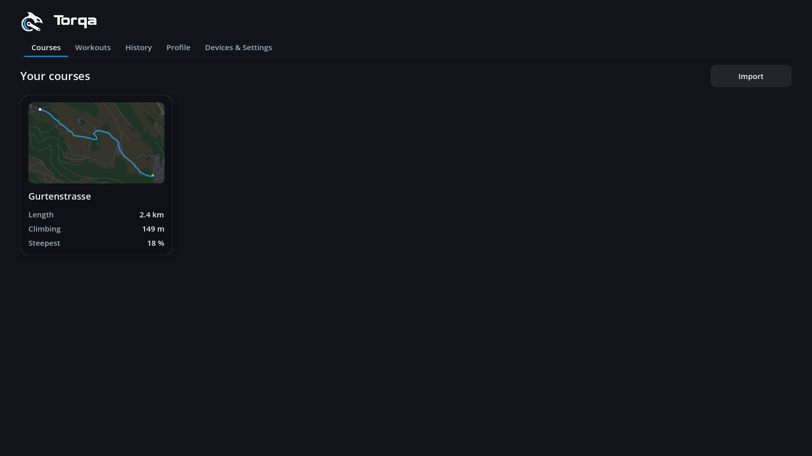
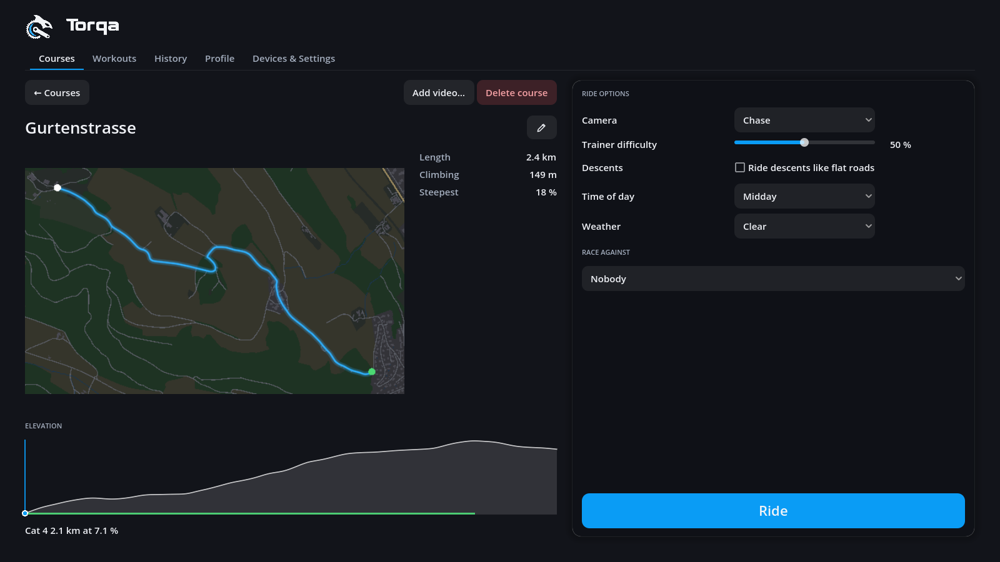

# Start page

Torqa opens on the start page with five tabs:

- **Courses** — your course library as cards: each shows the route on a map of its
  surroundings (a video course without a place on black), then length, climbing and steepest
  gradient; video courses are marked **Video**. **Import** prepares a GPX route (terrain, map,
  3D world) or a video with GPS ([video.md](video.md)) and adds it to the library, or adds a
  `.tqc` course file ([courses.md](courses.md)). Click a card for the course page: route, key
  figures, elevation profile with its climbs, your best times there, the ride options (camera,
  difficulty, descents, time of day, weather), who to race ([ghosts.md](ghosts.md)) and
  **Ride**. The 3D world is built when you press **Ride**, so looking around the library stays
  quick.
  On the course page, the pencil beside the name opens **Edit course**: rename it, or add a
  video to ride it along ([video.md](video.md)). The bin beside it (**Delete course**) removes
  the course after asking; your rides on it are kept.
- **Workouts** — hold a power, or a heart rate that Torqa holds for you by setting the power;
  ride a structured workout (built in, imported or your own) or an FTP test; on its own or on
  a course in 3D ([workouts.md](workouts.md)).
- **History** — your rides ([history.md](history.md)).
- **Profile** — who rides, their figures, editing them and their HUD, adding and deleting riders
  ([riders.md](riders.md), [hud.md](hud.md)).
- **Devices & Settings** — trainer, heart-rate strap and Di2 shifter, the ones used last
  reconnecting by themselves, and the graphics quality ([riding.md](riding.md)).

After a ride its summary appears; **Done** returns here.

